# TRAVEL - NestJS

> 링크: [TRAVEL2](https://travel2.sjungwon.site)  
> 프론트 Github: [travel-front](https://github.com/sjungwon/travel-frontend)  
> 스프링부트 Github: [travel-backend](https://github.com/sjungwon/travel-backend)

## 프로젝트 소개

> TRAVEL은 여행 정보 공유 커뮤니티입니다.  
> 여행지 정보와 후기를 공유할 수 있습니다.  
> 여행지 후기를 조합해 여행 일정을 만들어 공유할 수 있습니다.  
> 추가 기능으로 숙소에 방을 만들고 예약할 수 있습니다.

### 기술 스택

- Node.js
- NestJS
- TypeORM
- MySQL 8

### 프로젝트 설명

#### 1. 운영

- 백엔드
  - Nginx - docker 컨테이너
  - Dockerfile을 작성해서 빌드된 이미지로 서버 컨테이너 실행
  - 프론트단에서 서버 도메인으로 api 요청

#### 2. 경험

- 인증과 인가
  - NestJS에서 제공하는 래핑된 Passport 기능 사용
  - Passport jwt 전략 이용해서 인증 가드 구현
  - 요청이 필요한 곳에 jwt 가드를 적용하면 jwt 검증 후 요청 객체에 user 필드로 저장
  - Pipe로 jwt 가드가 저장한 user 필드를 핸들러에 유저 객체로 변환해서 전달
  - 로그인시 응답으로 jwt 반환
- TypeORM
  - SQL 쿼리와 유사한 객체 쿼리 작성
  - 스프링 부트의 @Transactional처럼 트랜잭션을 관리해주는 기능이 없어 트랜 잭션내에서 실행되어야 하는 쿼리는 콜백 형태으로 작성, EntityManger를 인자로 받아서 동일한 커넥션에서 실행하도록 작성
- 파일 업로드
  - Multer를 사용해서 Multipart/form-data 요청시 파일을 로컬 혹은 S3에 저장
  - 저장 전에 filename 혹은 key 생성 시 요청 객체 헤더에서 jwt 검증

#### 3. 기능

1. 여행지
   1. 여행지 조회  
      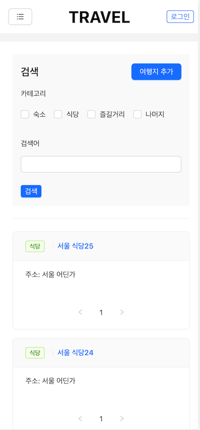
   2. 여행지 추가  
      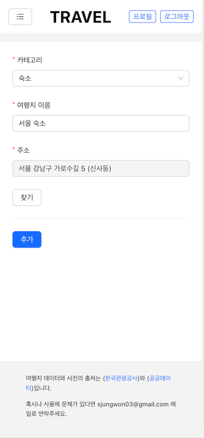
   3. 여행지 상세 조회  
      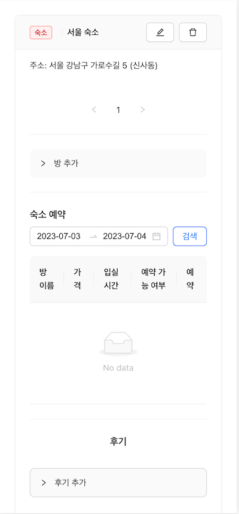
2. 후기
   1. 후기 추가  
      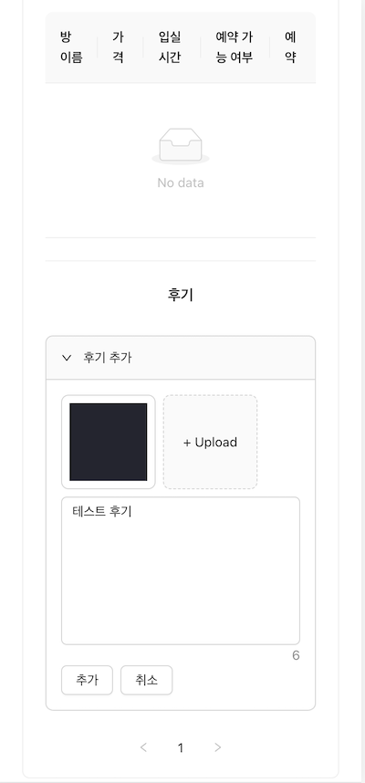
   2. 후기 조회  
      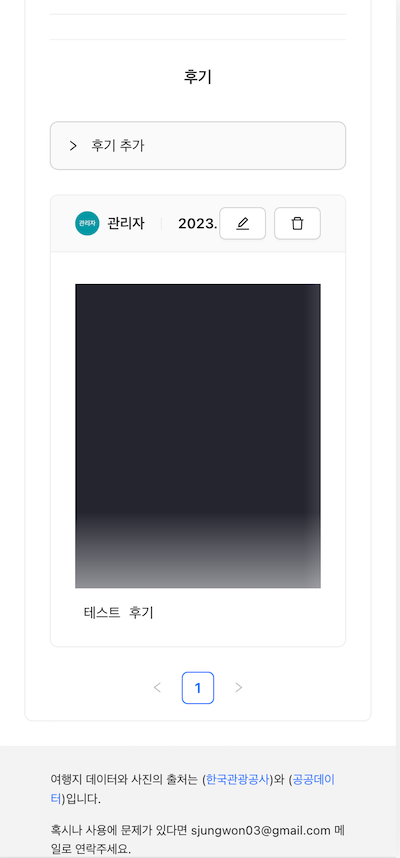
3. 여정
   1. 여정 추가  
      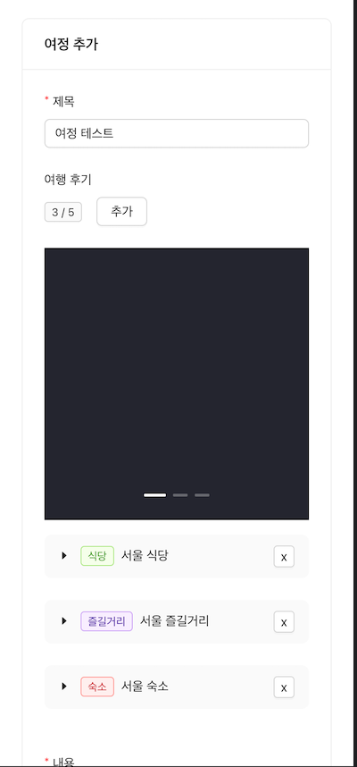
   2. 여정 조회  
      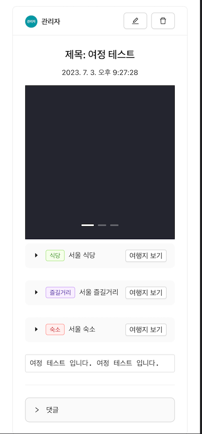
4. 방
   1. 방 추가  
      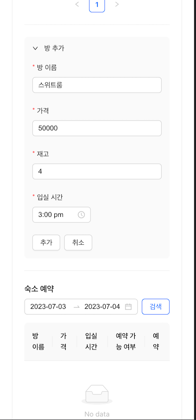
5. 예약
   1. 방 예약  
      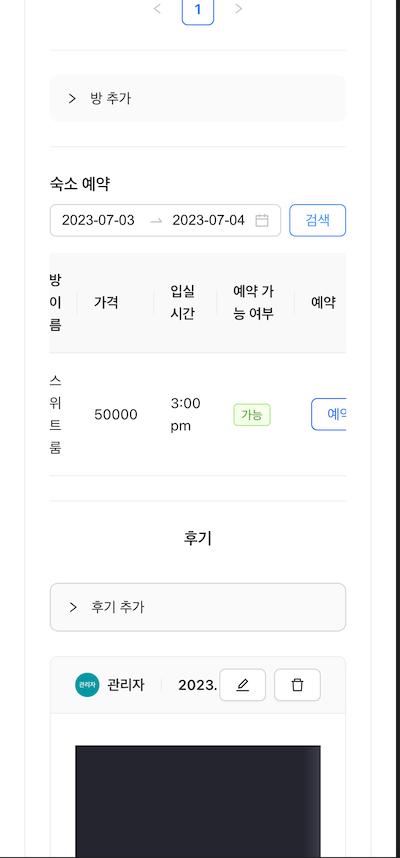
   2. 결제 페이지  
      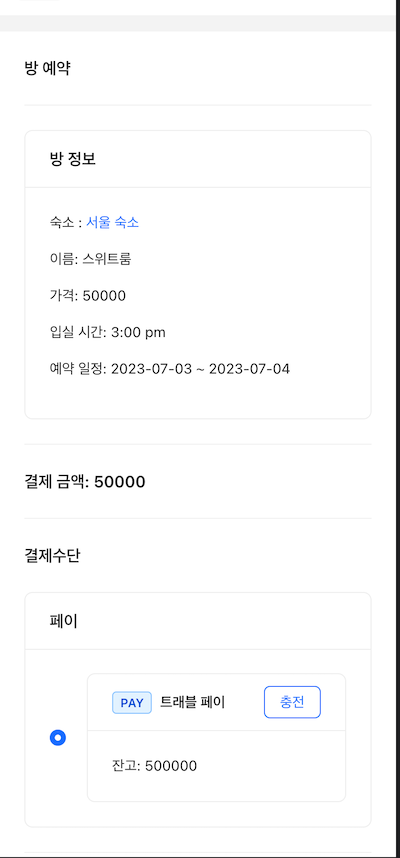
   3. 결제 내역  
      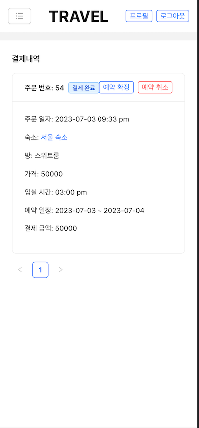
